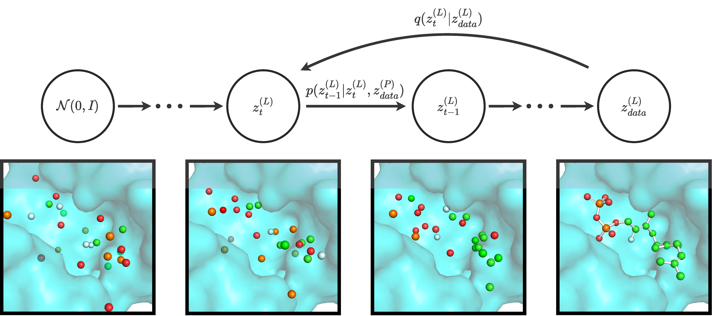

# DiffSBDD: Structure-based Drug Design with Equivariant Diffusion Models

Official implementation of **DiffSBDD**, an equivariant model for structure-based drug design, by Arne Schneuing*, Yuanqi Du*, Charles Harris, Arian Jamasb, Ilia Igashov, Weitao Du, Tom Blundell, Pietro Lió, Carla Gomes, Max Welling, Michael Bronstein & Bruno Correia.

[](http://arxiv.org/abs/2210.13695)
[](https://colab.research.google.com/github/arneschneuing/DiffSBDD/blob/main/colab/DiffSBDD.ipynb)



1. [Dependencies](#dependencies)
   1. [Conda environment](#conda-environment)
   2. [QuickVina 2](#quickvina-2)
   3. [Pre-trained models](#pre-trained-models)
2. [CrossDocked Benchmark](#crossdocked-benchmark)
3. [Binding MOAD](#binding-moad)
4. [Training](#training)
5. [Inference](#inference)
   1. [Sample molecules for a given pocket](#sample-molecules-for-a-given-pocket)
   2. [Test set sampling](#sample-molecules-for-all-pockets-in-the-test-set)
   3. [Fix substructures](#fix-substructures)
   4. [Metrics](#metrics)
   5. [QuickVina2](#quickvina2)
6. [Citation](#citation)

## Dependencies

### Conda environment
```bash
conda create -n sbdd-env
conda activate sbdd-env
conda install pytorch cudatoolkit=10.2 -c pytorch
conda install -c conda-forge pytorch-lightning
conda install -c conda-forge wandb
conda install -c conda-forge rdkit
conda install -c conda-forge biopython
conda install -c conda-forge imageio
conda install -c anaconda scipy
conda install -c pyg pytorch-scatter
conda install -c conda-forge openbabel
```

The code was tested with the following versions
| Software          | Version   |
|-------------------|-----------|
| Python            | 3.10.4    |
| CUDA              | 10.2.89   |
| PyTorch           | 1.12.1    |
| PyTorch Lightning | 1.7.4     |
| WandB             | 0.13.1    |
| RDKit             | 2022.03.2 |
| BioPython         | 1.79      |
| imageio           | 2.21.2    |
| SciPy             | 1.7.3     |
| PyTorch Scatter   | 2.0.9     |
| OpenBabel         | 3.1.1     |

### QuickVina 2
For docking, install QuickVina 2:
```bash
wget https://github.com/QVina/qvina/raw/master/bin/qvina2.1
chmod +x qvina2.1 
```

We need MGLTools for preparing the receptor for docking (pdb -> pdbqt) but it can mess up your conda environment, so I recommend to make a new one:
```bash
conda create -n mgltools -c bioconda mgltools
```

### Pre-trained models
Pre-trained models can be downloaded from [Zenodo](https://zenodo.org/record/8183747).
- [CrossDocked, conditional $C_\alpha$ model](https://zenodo.org/record/8183747/files/crossdocked_ca_cond.ckpt?download=1)
- [CrossDocked, joint $C_\alpha$ model](https://zenodo.org/record/8183747/files/crossdocked_ca_joint.ckpt?download=1)
- [CrossDocked, conditional full-atom model](https://zenodo.org/record/8183747/files/crossdocked_fullatom_cond.ckpt?download=1)
- [CrossDocked, joint full-atom model](https://zenodo.org/record/8183747/files/crossdocked_fullatom_joint.ckpt?download=1)
- [Binding MOAD, conditional $C_\alpha$ model](https://zenodo.org/record/8183747/files/moad_ca_cond.ckpt?download=1)
- [Binding MOAD, joint $C_\alpha$ model](https://zenodo.org/record/8183747/files/moad_ca_joint.ckpt?download=1)
- [Binding MOAD, conditional full-atom model](https://zenodo.org/record/8183747/files/moad_fullatom_cond.ckpt?download=1)
- [Binding MOAD, joint full-atom model](https://zenodo.org/record/8183747/files/moad_fullatom_joint.ckpt?download=1)

## CrossDocked Benchmark

### Data preparation
Download and extract the dataset as described by the authors of Pocket2Mol: https://github.com/pengxingang/Pocket2Mol/tree/main/data

Process the raw data using
```bash
python process_crossdock.py <crossdocked_dir> --no_H
```

## Binding MOAD
### Data preparation
Download the dataset
```bash
wget http://www.bindingmoad.org/files/biou/every_part_a.zip
wget http://www.bindingmoad.org/files/biou/every_part_b.zip
wget http://www.bindingmoad.org/files/csv/every.csv

unzip every_part_a.zip
unzip every_part_b.zip
```
Process the raw data using
``` bash
python -W ignore process_bindingmoad.py <bindingmoad_dir>
```
Add the `--ca_only` flag to create a dataset with $C_\alpha$ pocket representation.

## Training
Starting a new training run:
```bash
python -u train.py --config <config>.yml
```

Resuming a previous run:
```bash
python -u train.py --config <config>.yml --resume <checkpoint>.ckpt
```

## Inference

### Sample molecules for a given pocket
To sample small molecules for a given pocket with a trained model use the following command:
```bash
python generate_ligands.py <checkpoint>.ckpt --pdbfile <pdb_file>.pdb --outdir <output_dir> --resi_list <list_of_pocket_residue_ids>
```
For example:
```bash
python generate_ligands.py last.ckpt --pdbfile 1abc.pdb --outdir results/ --resi_list A:1 A:2 A:3 A:4 A:5 A:6 A:7 
```
Alternatively, the binding pocket can also be specified based on a reference ligand in the same PDB file:
```bash 
python generate_ligands.py <checkpoint>.ckpt --pdbfile <pdb_file>.pdb --outdir <output_dir> --ref_ligand <chain>:<resi>
```

Optional flags:
| Flag | Description |
|------|-------------|
| `--n_samples` | Number of sampled molecules |
| `--num_nodes_lig` | Size of sampled molecules |
| `--timesteps` | Number of denoising steps for inference |
| `--all_frags` | Keep all disconnected fragments |
| `--sanitize` | Sanitize molecules (invalid molecules will be removed if this flag is present) |
| `--relax` | Relax generated structure in force field |
| `--resamplings` | Inpainting parameter (doesn't apply if conditional model is used) |
| `--jump_length` | Inpainting parameter (doesn't apply if conditional model is used) |

### Sample molecules for all pockets in the test set
`test.py` can be used to sample molecules for the entire testing set:
```bash
python test.py <checkpoint>.ckpt --test_dir <bindingmoad_dir>/processed_noH/test/ --outdir <output_dir> --sanitize
```
There are different ways to determine the size of sampled molecules. 
- `--fix_n_nodes`: generates ligands with the same number of nodes as the reference molecule
- `--n_nodes_bias <int>`: samples the number of nodes randomly and adds this bias
- `--n_nodes_min <int>`: samples the number of nodes randomly but clamps it at this value

Other optional flags are equivalent to `generate_ligands.py`. 

### Fix substructures
`inpaint.py` can be used for partial ligand redesign with the conditionally trained model, e.g.:
```bash 
python inpaint.py <checkpoint>.ckpt --pdbfile <pdb_file>.pdb --outdir <output_dir> --ref_ligand <chain>:<resi> --fix_atoms C1 N6 C5 C12
```
`--add_n_nodes` controls the number of newly generated nodes

### Metrics
For assessing basic molecular properties create an instance of the `MoleculeProperties` class and run its `evaluate` method:
```python
from analysis.metrics import MoleculeProperties
mol_metrics = MoleculeProperties()
all_qed, all_sa, all_logp, all_lipinski, per_pocket_diversity = \
    mol_metrics.evaluate(pocket_mols)
```
`evaluate()` expects a list of lists where the inner list contains all RDKit molecules generated for one pocket.

For computing docking scores, run QuickVina as described below. 

### QuickVina2
First, convert all protein PDB files to PDBQT files using MGLTools
```bash
conda activate mgltools
cd analysis
python docking_py27.py <bindingmoad_dir>/processed_noH/test/ <output_dir> bindingmoad
cd ..
conda deactivate
```
Then, compute QuickVina scores:
```bash
conda activate sbdd-env
python analysis/docking.py --pdbqt_dir <docking_py27_outdir> --sdf_dir <test_outdir> --out_dir <qvina_outdir> --write_csv --write_dict
```

## Citation
```
@article{schneuing2022structure,
  title={Structure-based Drug Design with Equivariant Diffusion Models},
  author={Schneuing, Arne and Du, Yuanqi and Harris, Charles and Jamasb, Arian and Igashov, Ilia and Du, Weitao and Blundell, Tom and Li{\'o}, Pietro and Gomes, Carla and Welling, Max and Bronstein, Michael and Correia, Bruno},
  journal={arXiv preprint arXiv:2210.13695},
  year={2022}
}
```
